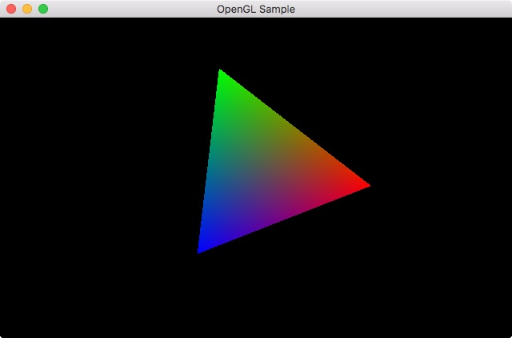

# OpenGLSample

OpenGL and GLFW sample program for Swift on OS X.

## GLFW

This projects contains GLFW version 3.3 binary.
You can get the binary by following steps.

### How to build the latest version

1. Prepare CMake. (e.g. `port install cmake`)
2. Prepare a working directory. (e.g. `mkdir ~/foo`)
3. Open terminal at the working directory. (e.g. `cd ~/foo`)
4. Clone a repository : `git clone https://github.com/glfw/glfw.git`
5. Prepare a build directory. (e.g. `mkdir osx && cd osx`)
6. Configure: `cmake ../glfw`
7. Build: `make all`
8. Copy `~/foo/glfw/include/GLFW/glfw3.h` into your project directory.
9. Copy  `~/foo/osx/src/libglfw3.a`. into your project project.

## Requirements

* macOS 10.12.6
* Xcode 8.3.3
* Swift 3.1

## License

Please read [this file](LICENSE). 
GLFW is licensed under the [zlib/libpnglicense](http://www.glfw.org/license.html).